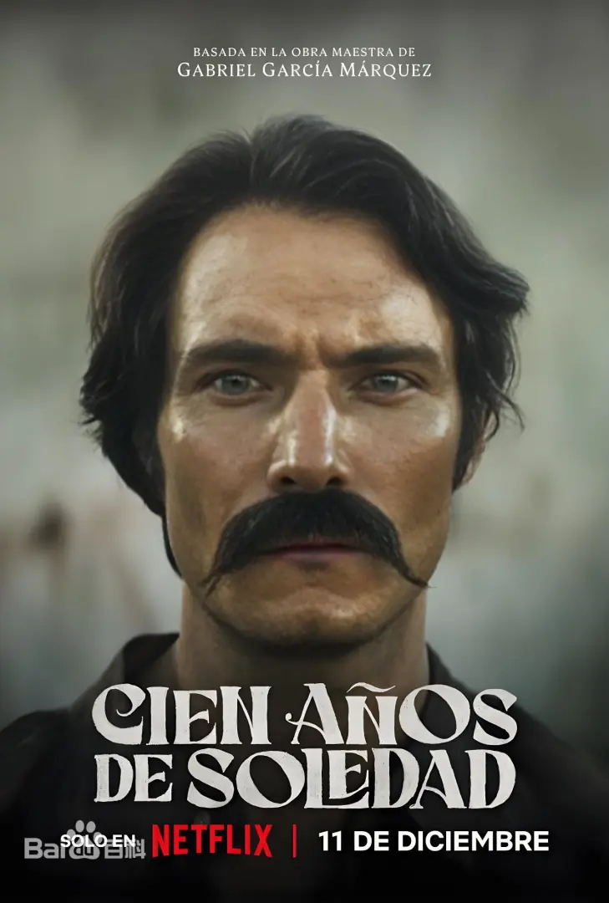
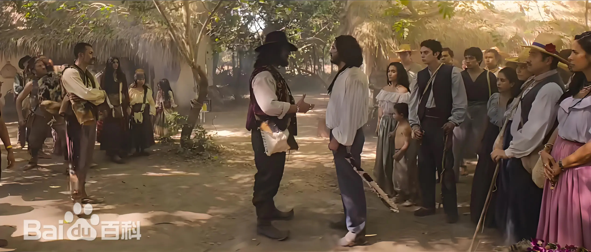
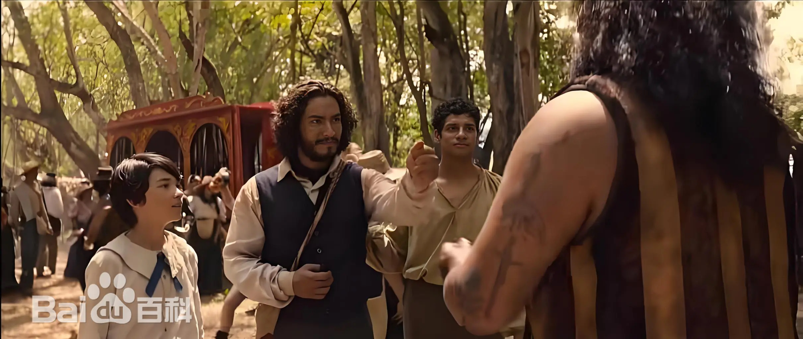
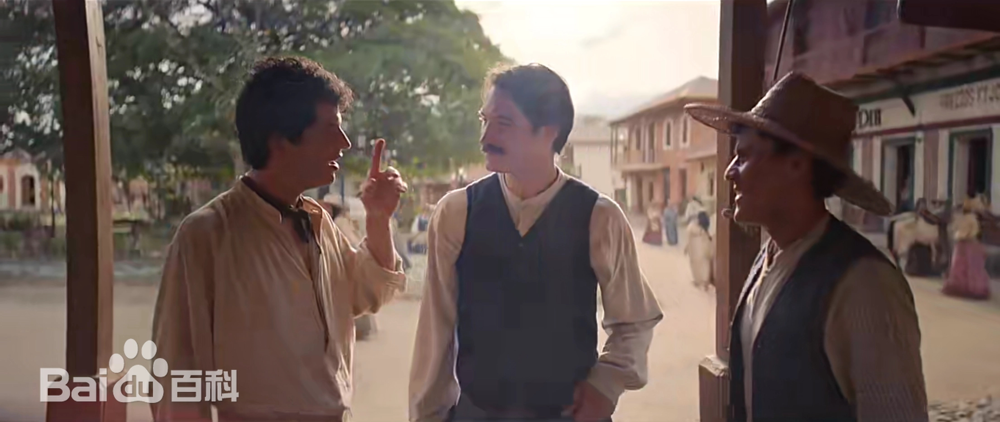

《百年孤独》（Cien Años de Soledad）是由Netflix出品，Dynamo制作，亚历克斯·加西亚·洛佩斯和劳拉·莫拉·奥尔特加共同执导，卡米拉·布鲁日、阿尔巴特罗斯·冈萨雷斯、约瑟·里韦拉、娜塔莉亚·桑塔、玛丽亚‧卡米拉‧阿里亚斯编剧，马可·冈萨雷斯、克劳迪奥·卡塔诺、苏珊娜·莫拉莱斯、杰罗尼莫·巴伦等主演的奇幻历史剧。

该剧根据加夫列尔·加西亚·马尔克斯（Gabriel García Márquez）1967年的同名小说《百年孤独》（Cien Años de Soledad）改编，讲述了在永恒的马孔多小镇，布恩迪亚家族七代人在爱情、遗忘以及他们无法摆脱的过去和命运中徘徊的故事。

该剧共16集，分为上下两部分播出，2024年12月6日，前两集将在哈瓦那电影节首映，12月11日第一部8集将在Netflix播出，第二部稍后播出，具体日期尚未公布。

